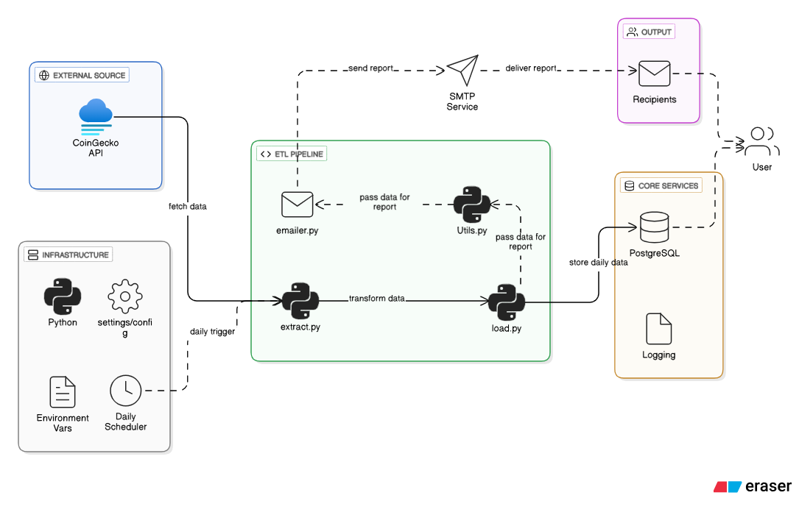

#  CoinGecko Cryptocurrency ETL Pipeline

A fully modular, production-ready ETL (Extract, Transform, Load) pipeline that pulls cryptocurrency data from the **CoinGecko API**, transforms it with **pandas**, loads it into **PostgreSQL**, and sends an automated **HTML email report** with an attached in-memory CSV file.



This project is designed with a clean repository architecture, configurable environment variables, structured logging, and daily scheduling.

---

# Features
- **Modular ETL architecture** (extract, load, email, utils)
- **Daily automated scheduling** using `schedule`
- **Environment-driven configuration** via `.env`
- **In-memory CSV attachment** (no local file creation)
- **HTML formatted email report**
- **PostgreSQL integration** with auto-DB creation
- **Duplicate-safe daily inserts** (removes existing data for the day)
---

## Architecture Flow Chart

```
flowchart TD
    A[CoinGecko API] -->|HTTP Requests| B[Extract Layer<br/>Python Script]

    B --> C[Data Processing<br/>Parse JSON & Clean Data]

    C --> D[Database Layer<br/>PostgreSQL]
    D -->|Append / Replace| D1[crypto_prices_table]

    D --> E[Summary Logic<br/>Python Aggregations]

    E --> F[Email Service<br/>SMTP / Gmail API]
    F --> G[Daily Summary Email]

    H[Scheduler<br/>Cron / Task Scheduler] -->|Triggers| B
```
---

# 📁 Repository Structure
```
COINGECKO_API/
├── .env
├── README.md
├── requirements.txt
├── main.py
├── configs/
│   ├── __init__.py
│   └── settings.py
├── etl/
│   ├── __init__.py
│   ├── extract.py
│   ├── load.py
│   ├── emailer.py
│   └── utils.py
└── logs/
    └── etl.log
```

---

# ⚙️ Tech Stack
| Area | Tools |
|------|--------|
| Extraction | `requests` |
| Transformation | `pandas`, `datetime` |
| DB Connection | `psycopg2`, `SQLAlchemy` |
| Email | `smtplib`, `email.mime` |
| Scheduling | `schedule` |
| Config | `python-dotenv` |
| Logging | `logging`, `RotatingFileHandler` |

---

# 🔧 Configuration (Environment Variables)
All sensitive values live inside `.env`:
```
POSTGRES_HOST=localhost
POSTGRES_PORT=5432
POSTGRES_USER=postgres
POSTGRES_PASSWORD=yourpassword
POSTGRES_DB=crypto_db

EMAIL_SENDER=youremail@gmail.com
EMAIL_PASSWORD=your_smtp_app_password
EMAIL_RECEIVERS=abc@gmail.com,xyz@hotmail.com

SCHEDULE_TIME=09:00
COINGECKO_PER_PAGE=250
COINGECKO_PAGE=1
```

---

# Module Breakdown

## `configs/settings.py`
Loads configuration variables from the `.env` file.
All modules import settings via:
```
from configs import settings
```

---

## `etl/utils.py`
Central logging utility.
- Creates `logs/etl.log`
- Log style: `=== message ===`
- Ensures log directory exists

---

## `etl/extract.py`
Handles all API extraction and transformation.

### Responsibilities:
- Fetch crypto data from CoinGecko
- Select columns + add timestamp
- Generate top 10 gainers & losers
- Produce CSV file **in memory**
- Return dictionary containing all ETL-ready components

**Run manually:**
```
python -m etl.extract
```

---

## `etl/load.py`
Handles all Postgres operations.

### Responsibilities:
- Create database if it doesn't exist
- Connect using SQLAlchemy
- Create `crypto_data` table (if missing)
- Delete today's data (duplicate-safe)
- Insert fresh daily records

**Run manually:**
```
python -m etl.load
```

---

## `etl/emailer.py`
Builds and sends an HTML email with:
- HTML market summary
- Top 10 gainers and losers
- CSV attachment (in-memory)

Uses Gmail SMTP by default (configurable).

---

# 🧠 Workflow Overview
```
Extract → Transform → Load → Email → Log
```

1. Pull fresh crypto data from API  
2. Build pandas DataFrame  
3. Delete existing rows for today  
4. Insert new cleaned data  
5. Generate HTML summary tables  
6. Send email report with CSV attachment  
7. Log entire process  

---

# 🕒 Scheduling
The ETL job runs daily at the time specified in `.env`:
```
SCHEDULE_TIME=09:00
```

`main.py` handles scheduling:
```
python main.py
```

Runs indefinitely, firing your ETL once per day.

To run once without scheduling:
```python
# In main.py
run_etl()
```

---

# How to Run the Entire Project

### 1. Install dependencies
```
pip install -r requirements.txt
```

### 2. Configure `.env`
Update Postgres + email credentials.

### 3. Run scheduled ETL service
```
python main.py
```

### 4. Run ETL once (manual trigger)
```
python -m etl.extract
python -m etl.load
```
OR
```
python main.py  # with run_etl() uncommented
```

---

# 📬 Email Report (HTML)
The email contains:
- Greeting
- Daily summary description
- **Top 10 gainers** table
- **Top 10 losers** table
- Professional footer
---

# Example Table Schema
```
CREATE TABLE crypto_data (
    id VARCHAR(100),
    symbol VARCHAR(50),
    name VARCHAR(150),
    current_price DOUBLE PRECISION,
    market_cap DOUBLE PRECISION,
    price_change_percentage_24h DOUBLE PRECISION,
    ath DOUBLE PRECISION,
    atl DOUBLE PRECISION,
    time_stamp TIMESTAMP
);
```

---

# 🗂 Versioning
**Current Version:** 2.0  
**Updated:** November 2025

---

# Summary
A complete, modular, production-ready ETL pipeline integrating:
- Live API extraction  
- Pandas transformations  
- PostgreSQL loading  
- Daily email reporting  
- Scheduling  
- Logging  

A reusable and extendable foundation for automated data engineering workflows.

---

# 📫 Contact

## Oluwatosin Amosu Bolaji 
- Data Engineer 
- Buiness Intelligence Analyst
- ETL Developer

#### 🚀 **Always learning. Always building. Data-driven to the core.**  

### 📫 **Let’s connect!**  
- 📩 oluwabolaji60@gmail.com
- 🔗 : [LinkedIn](https://www.linkedin.com/in/oluwatosin-amosu-722b88141)
- 🌐 : [My Portfolio](https://www.datascienceportfol.io/oluwabolaji60) 
- 𝕏 : [Twitter/X](https://x.com/thee_oluwatosin?s=21&t=EqoeQVdQd038wlSUzAtQzw)
- 🔗 : [Medium](https://medium.com/@oluwabolaji60)
- 🔗 : [View my Repositories](https://github.com/Tbrown1998?tab=repositories)